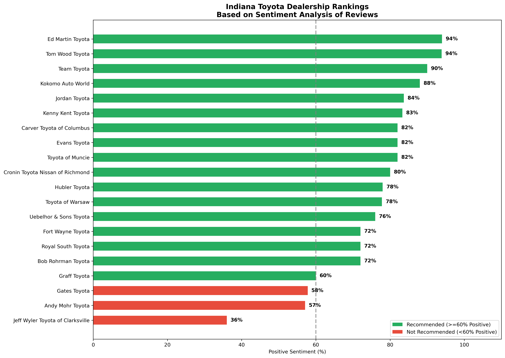
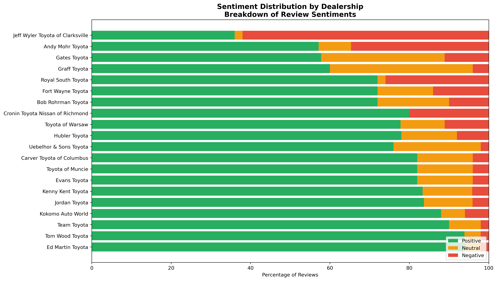
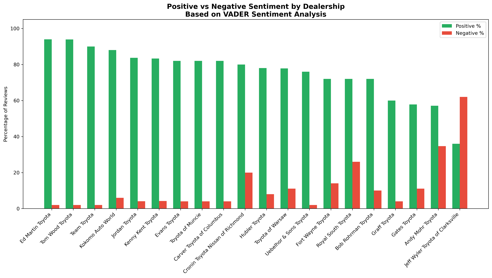

# 🚗 Indiana Toyota Dealership Sentiment Analysis

A web scraping and natural language processing project that analyzes customer reviews of Toyota dealerships across Indiana to rank and evaluate dealership performance based on customer sentiment.

---

## 📌 Project Overview

This project scrapes customer reviews from **DealerRater** for Indiana Toyota dealerships and applies sentiment analysis using **TextBlob** and **VADER** to score and rank each dealership. The goal is to surface actionable insights about which dealerships deliver the best — and worst — customer experiences, based entirely on real customer feedback.

---

## 🔍 What It Does

- **Scrapes** up to 5 pages of customer reviews per dealership from DealerRater
- **Cleans and preprocesses** raw review text for analysis
- **Runs dual sentiment analysis** using both TextBlob and VADER
- **Scores and ranks** each dealership by positive sentiment percentage
- **Generates visualizations** to clearly communicate findings
- **Exports** results to CSV for further analysis

---

## 📊 Visualizations

### 1. Dealer Rankings by Positive Sentiment


*Horizontal bar chart showing all 20 dealerships ranked by percentage of positive reviews. Green = Recommended (≥60%), Red = Not Recommended (<60%). The dashed line marks the 60% threshold.*

---

### 2. Sentiment Distribution by Dealership


*Stacked horizontal bar chart showing the breakdown of Positive (green), Neutral (yellow), and Negative (red) reviews for each dealership. Notice Jeff Wyler Toyota's large red section (62% negative).*

---

### 3. Positive vs Negative Sentiment Comparison


*Grouped bar chart comparing positive and negative sentiment percentages side-by-side for each dealership.*

---

## 🏆 Key Findings

### Top Performers (>90% Positive)
| Dealer | Positive % | Status |
|--------|------------|--------|
| Ed Martin Toyota | 94.0% | ✅ Recommended |
| Tom Wood Toyota | 93.9% | ✅ Recommended |
| Team Toyota | 90.0% | ✅ Recommended |

### Warning Signs (<60% Positive)
| Dealer | Positive % | Negative % | Key Customer Complaints |
|--------|------------|------------|------------------------|
| Gates Toyota | 57.8% | 11.1% | "No hospitality whatsoever" - Unfriendly staff |
| Andy Mohr Toyota | 57.1% | 34.7% | Overcharging - "Signed $700, charged $1,100" |
| Jeff Wyler Toyota | 36.0% | 62.0% | "Financial team stealing $4,240" - Hidden fees |

**Result:** 17 out of 20 dealerships (85%) are **Recommended** based on sentiment analysis.

---

## 🛠️ Tech Stack

| Tool | Purpose |
|---|---|
| `requests` + `BeautifulSoup` | Web scraping DealerRater |
| `pandas` | Data manipulation and export |
| `TextBlob` | Polarity-based sentiment scoring |
| `VADER` | Compound sentiment scoring (optimized for reviews) |
| `matplotlib` + `numpy` | Data visualization |

---

## 📁 Output Files

```
indiana_toyota_reviews.csv     # All scraped and cleaned reviews with sentiment scores
indiana_toyota_scores.csv      # Dealer-level scorecard with rankings
dealer_rankings.png            # Visualization: dealer rankings
positive_vs_negative.png       # Visualization: pos vs neg by dealer
sentiment_distribution.png     # Visualization: full sentiment breakdown
```

---

## 🚀 How to Run

**1. Clone the repository**
```bash
git clone https://github.com/pnyado-droid/indiana_toyota_analysis.git
cd indiana_toyota_analysis
```

**2. Install dependencies**
```bash
pip install requests beautifulsoup4 pandas textblob vaderSentiment matplotlib numpy
```

**3. Run the analysis**

Open `indiana_toyota_analysis.qmd` in VS Code or JupyterLab and run all cells, or render with Quarto:
```bash
quarto render indiana_toyota_analysis.qmd
```

---

## 📈 Scoring Methodology

Each dealership is scored based on the sentiment of its customer reviews:

- **Positive** → VADER compound score ≥ 0.05
- **Neutral** → VADER compound score between -0.05 and 0.05
- **Negative** → VADER compound score ≤ -0.05

**Overall Score** = `Positive% - (Negative% × 0.5)`

Dealerships with **≥ 60% positive reviews** are marked as ✅ **Recommended**.

---

## 👤 Author

**pridenyado** · [GitHub](https://github.com/pnyado-droid)

---

## 📄 License

This project is for educational and analytical purposes only. Review data is sourced from publicly available pages on DealerRater.
